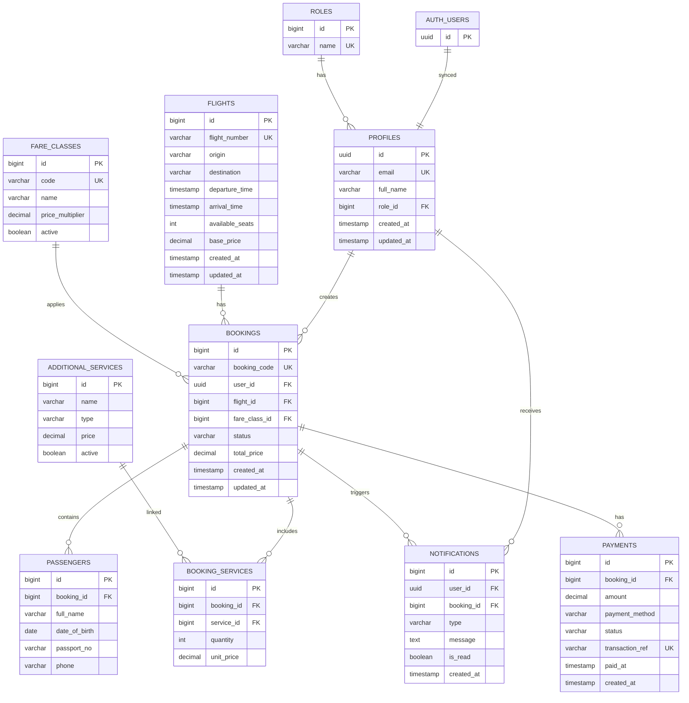

# Database Design Specification — Airline Booking System

**Phiên bản:** 1.0
**Database Engine:** PostgreSQL
**Tài liệu tham chiếu:** [SRS.md](./SRS.md)

---

## 1. ER Diagram



---

## 2. Enum / Domain Values

| Enum               | Giá trị                                               | Sử dụng                    |
| ------------------ | ----------------------------------------------------- | -------------------------- |
| **booking_status** | `PENDING`, `CONFIRMED`, `CANCELLED`, `PAYMENT_FAILED` | `bookings.status`          |
| **payment_status** | `SUCCESS`, `FAILED`                                   | `payments.status`          |
| **role_name**      | `CUSTOMER`, `ADMIN`                                   | `roles.name`               |
| **service_type**   | `BAGGAGE`, `MEAL`, `SEAT`, `PRIORITY_BOARDING`        | `additional_services.type` |

---

## 3. Đặc tả chi tiết các bảng

### 3.1. `roles`

| Cột    | Kiểu          | Constraints          | Mô tả                   |
| ------ | ------------- | -------------------- | ----------------------- |
| `id`   | `BIGSERIAL`   | `PRIMARY KEY`        | ID tự tăng              |
| `name` | `VARCHAR(50)` | `NOT NULL`, `UNIQUE` | `CUSTOMER` hoặc `ADMIN` |

---

### 3.2. `profiles`

| Cột          | Kiểu           | Constraints                          | Mô tả                           |
| ------------ | -------------- | ------------------------------------ | ------------------------------- |
| `id`         | `UUID`         | `PRIMARY KEY`, `FK → auth.users(id)` | ID từ Supabase Auth             |
| `email`      | `VARCHAR(255)` | `NOT NULL`, `UNIQUE`                 | Email đăng nhập                 |
| `full_name`  | `VARCHAR(255)` | `NOT NULL`                           | Họ tên                          |
| `role_id`    | `BIGINT`       | `NOT NULL`, `FK → roles(id)`         |                                 |
| `created_at` | `TIMESTAMP`    | `NOT NULL`, `DEFAULT NOW()`          |                                 |
| `updated_at` | `TIMESTAMP`    | `NOT NULL`, `DEFAULT NOW()`          |                                 |

**Index:** `idx_profiles_email` ON `(email)`

> **Ghi chú:** Cột `password` đã được loại bỏ — việc xác thực và lưu trữ mật khẩu do Supabase Auth (`auth.users`) quản lý.

---

### 3.3. `flights`

| Cột               | Kiểu            | Constraints                 | Mô tả                            |
| ----------------- | --------------- | --------------------------- | -------------------------------- |
| `id`              | `BIGSERIAL`     | `PRIMARY KEY`               |                                  |
| `flight_number`   | `VARCHAR(20)`   | `NOT NULL`, `UNIQUE`        | Số hiệu chuyến bay (VD: `VN123`) |
| `origin`          | `VARCHAR(100)`  | `NOT NULL`                  | Điểm đi                          |
| `destination`     | `VARCHAR(100)`  | `NOT NULL`                  | Điểm đến                         |
| `departure_time`  | `TIMESTAMP`     | `NOT NULL`                  | Thời gian khởi hành              |
| `arrival_time`    | `TIMESTAMP`     | `NOT NULL`                  | Thời gian đến                    |
| `base_price`      | `DECIMAL(15,2)` | `NOT NULL`                  | Giá cơ bản                       |
| `available_seats` | `INTEGER`       | `NOT NULL`, `CHECK(>=0)`    | Số ghế còn lại                   |
| `created_at`      | `TIMESTAMP`     | `NOT NULL`, `DEFAULT NOW()` |                                  |
| `updated_at`      | `TIMESTAMP`     | `NOT NULL`, `DEFAULT NOW()` |                                  |

**Index:** `idx_flights_search` ON `(origin, destination, departure_time)` — phục vụ Search Flights.

---

### 3.4. `fare_classes`

| Cột                | Kiểu           | Constraints                | Mô tả                                         |
| ------------------ | -------------- | -------------------------- | --------------------------------------------- |
| `id`               | `BIGSERIAL`    | `PRIMARY KEY`              |                                               |
| `code`             | `VARCHAR(20)`  | `NOT NULL`, `UNIQUE`       | Mã hạng vé (`ECONOMY`, `PREMIUM`, `BUSINESS`) |
| `name`             | `VARCHAR(100)` | `NOT NULL`                 | Tên hiển thị                                  |
| `price_multiplier` | `DECIMAL(5,2)` | `NOT NULL`, `CHECK(>0)`    | Hệ số nhân giá                                |
| `active`           | `BOOLEAN`      | `NOT NULL`, `DEFAULT TRUE` |                                               |

---

### 3.5. `bookings`

| Cột             | Kiểu            | Constraints                         | Mô tả                     |
| --------------- | --------------- | ----------------------------------- | ------------------------- |
| `id`            | `BIGSERIAL`     | `PRIMARY KEY`                       |                           |
| `booking_code`  | `VARCHAR(20)`   | `NOT NULL`, `UNIQUE`                | Mã booking (sinh tự động) |
| `user_id`       | `UUID`          | `NOT NULL`, `FK → profiles(id)`     |                           |
| `flight_id`     | `BIGINT`        | `NOT NULL`, `FK → flights(id)`      |                           |
| `fare_class_id` | `BIGINT`        | `NOT NULL`, `FK → fare_classes(id)` |                           |
| `status`        | `VARCHAR(20)`   | `NOT NULL`, `DEFAULT 'PENDING'`     | Enum: `booking_status`    |
| `total_price`   | `DECIMAL(15,2)` | `NOT NULL`                          | Tổng tiền                 |
| `created_at`    | `TIMESTAMP`     | `NOT NULL`, `DEFAULT NOW()`         |                           |
| `updated_at`    | `TIMESTAMP`     | `NOT NULL`, `DEFAULT NOW()`         |                           |

**Index:** `idx_bookings_user` ON `(user_id)` — phục vụ Booking History.
**Index:** `idx_bookings_status` ON `(status)` — phục vụ Admin filter.

**State transitions (BR-003):**

```text
PENDING → CONFIRMED
PENDING → CANCELLED
PENDING → PAYMENT_FAILED
```

---

### 3.6. `passengers`

| Cột             | Kiểu           | Constraints                                       | Mô tả       |
| --------------- | -------------- | ------------------------------------------------- | ----------- |
| `id`            | `BIGSERIAL`    | `PRIMARY KEY`                                     |             |
| `booking_id`    | `BIGINT`       | `NOT NULL`, `FK → bookings(id) ON DELETE CASCADE` |             |
| `full_name`     | `VARCHAR(255)` | `NOT NULL`                                        |             |
| `date_of_birth` | `DATE`         | `NOT NULL`                                        |             |
| `passport_no`   | `VARCHAR(50)`  | `NOT NULL`                                        | Số hộ chiếu |
| `phone`         | `VARCHAR(20)`  | `NOT NULL`                                        |             |

---

### 3.7. `additional_services`

| Cột      | Kiểu            | Constraints                | Mô tả                |
| -------- | --------------- | -------------------------- | -------------------- |
| `id`     | `BIGSERIAL`     | `PRIMARY KEY`              |                      |
| `name`   | `VARCHAR(100)`  | `NOT NULL`                 | Tên dịch vụ          |
| `type`   | `VARCHAR(30)`   | `NOT NULL`                 | Enum: `service_type` |
| `price`  | `DECIMAL(15,2)` | `NOT NULL`, `CHECK(>=0)`   | Giá dịch vụ          |
| `active` | `BOOLEAN`       | `NOT NULL`, `DEFAULT TRUE` |                      |

---

### 3.8. `booking_services`

Bảng trung gian N–M giữa `bookings` và `additional_services`.

| Cột          | Kiểu            | Constraints                                       | Mô tả                              |
| ------------ | --------------- | ------------------------------------------------- | ---------------------------------- |
| `id`         | `BIGSERIAL`     | `PRIMARY KEY`                                     |                                    |
| `booking_id` | `BIGINT`        | `NOT NULL`, `FK → bookings(id) ON DELETE CASCADE` |                                    |
| `service_id` | `BIGINT`        | `NOT NULL`, `FK → additional_services(id)`        |                                    |
| `quantity`   | `INTEGER`       | `NOT NULL`, `DEFAULT 1`, `CHECK(>0)`              | Số lượng                           |
| `unit_price` | `DECIMAL(15,2)` | `NOT NULL`                                        | Giá snapshot tại thời điểm booking |

**Unique:** `(booking_id, service_id)` — mỗi dịch vụ chỉ xuất hiện 1 lần/booking.

---

### 3.9. `payments`

| Cột               | Kiểu            | Constraints                     | Mô tả                           |
| ----------------- | --------------- | ------------------------------- | ------------------------------- |
| `id`              | `BIGSERIAL`     | `PRIMARY KEY`                   |                                 |
| `booking_id`      | `BIGINT`        | `NOT NULL`, `FK → bookings(id)` |                                 |
| `amount`          | `DECIMAL(15,2)` | `NOT NULL`                      | Số tiền                         |
| `payment_method`  | `VARCHAR(50)`   | `NOT NULL`                      | VD: `CREDIT_CARD`, `MOCK`       |
| `status`          | `VARCHAR(20)`   | `NOT NULL`                      | Enum: `payment_status`          |
| `transaction_ref` | `VARCHAR(100)`  | `UNIQUE`                        | Mã giao dịch mock               |
| `paid_at`         | `TIMESTAMP`     |                                 | Thời gian thanh toán thành công |
| `created_at`      | `TIMESTAMP`     | `NOT NULL`, `DEFAULT NOW()`     |                                 |

---

### 3.10. `notifications`

| Cột          | Kiểu          | Constraints                  | Mô tả                                        |
| ------------ | ------------- | ---------------------------- | -------------------------------------------- |
| `id`         | `BIGSERIAL`   | `PRIMARY KEY`                    |                                              |
| `user_id`    | `UUID`        | `NOT NULL`, `FK → profiles(id)`  |                                              |
| `booking_id` | `BIGINT`      | `FK → bookings(id)`              | Nullable nếu thông báo hệ thống chung        |
| `type`       | `VARCHAR(50)` | `NOT NULL`                   | VD: `BOOKING_CONFIRMED`, `BOOKING_CANCELLED` |
| `message`    | `TEXT`        | `NOT NULL`                   | Nội dung                                     |
| `is_read`    | `BOOLEAN`     | `NOT NULL`, `DEFAULT FALSE`  |                                              |
| `created_at` | `TIMESTAMP`   | `NOT NULL`, `DEFAULT NOW()`  |                                              |

**Index:** `idx_notifications_user_unread` ON `(user_id, is_read)` — hiển thị badge chưa đọc.

---

## 4. Tổng hợp quan hệ

| Quan hệ                                | Mô tả                                                     |
| -------------------------------------- | --------------------------------------------------------- |
| `auth.users` 1 → 1 `profiles`          | Tự động đồng bộ qua trigger `on_auth_user_created`        |
| `roles` 1 → N `profiles`               | Mỗi profile thuộc 1 role                                  |
| `profiles` 1 → N `bookings`            | Mỗi user có nhiều booking                                 |
| `flights` 1 → N `bookings`             | Mỗi chuyến bay có nhiều booking                           |
| `fare_classes` 1 → N `bookings`        | Mỗi hạng vé áp dụng cho nhiều booking                     |
| `bookings` 1 → N `passengers`          | Mỗi booking có ≥ 1 passenger (BR-001)                     |
| `bookings` N ↔ M `additional_services` | Qua bảng `booking_services`                               |
| `bookings` 1 → N `payments`            | Mỗi booking có thể có nhiều lần thanh toán                |
| `profiles` 1 → N `notifications`       | Mỗi user nhận nhiều notification                          |
| `bookings` 1 → N `notifications`       | Mỗi booking có thể sinh nhiều notification                |

---

## 5. Công thức tính giá (BR-002)

```
Ticket Price = flights.base_price × fare_classes.price_multiplier

Total Price  = Σ Ticket Price
             + Σ (booking_services.unit_price × booking_services.quantity)
```

---

## 6. DDL Script

```sql
-- Enums (dùng VARCHAR + CHECK thay vì PostgreSQL ENUM để dễ thêm giá trị)

-- Enable UUID extension (usually already enabled on Supabase)
CREATE EXTENSION IF NOT EXISTS "uuid-ossp";

CREATE TABLE roles (
    id          BIGSERIAL PRIMARY KEY,
    name        VARCHAR(50) NOT NULL UNIQUE
);

-- Profiles table: replaces old `users` table
-- id is UUID matching auth.users(id) from Supabase Auth
CREATE TABLE profiles (
    id          UUID PRIMARY KEY REFERENCES auth.users(id) ON DELETE CASCADE,
    email       VARCHAR(255) NOT NULL UNIQUE,
    full_name   VARCHAR(255) NOT NULL,
    role_id     BIGINT NOT NULL REFERENCES roles(id),
    created_at  TIMESTAMP NOT NULL DEFAULT NOW(),
    updated_at  TIMESTAMP NOT NULL DEFAULT NOW()
);
CREATE INDEX idx_profiles_email ON profiles(email);

-- Auto-create profile when a new user signs up via Supabase Auth
CREATE OR REPLACE FUNCTION public.handle_new_user()
RETURNS trigger AS $$
BEGIN
    INSERT INTO public.profiles (id, email, full_name, role_id)
    VALUES (
        NEW.id,
        NEW.email,
        COALESCE(NEW.raw_user_meta_data->>'full_name', ''),
        (SELECT id FROM public.roles WHERE name = 'CUSTOMER')
    );
    RETURN NEW;
END;
$$ LANGUAGE plpgsql SECURITY DEFINER;

CREATE TRIGGER on_auth_user_created
    AFTER INSERT ON auth.users
    FOR EACH ROW EXECUTE FUNCTION public.handle_new_user();

CREATE TABLE flights (
    id              BIGSERIAL PRIMARY KEY,
    flight_number   VARCHAR(20) NOT NULL UNIQUE,
    origin          VARCHAR(100) NOT NULL,
    destination     VARCHAR(100) NOT NULL,
    departure_time  TIMESTAMP NOT NULL,
    arrival_time    TIMESTAMP NOT NULL,
    base_price      DECIMAL(15,2) NOT NULL,
    available_seats INTEGER NOT NULL CHECK (available_seats >= 0),
    created_at      TIMESTAMP NOT NULL DEFAULT NOW(),
    updated_at      TIMESTAMP NOT NULL DEFAULT NOW()
);
CREATE INDEX idx_flights_search ON flights(origin, destination, departure_time);

CREATE TABLE fare_classes (
    id               BIGSERIAL PRIMARY KEY,
    code             VARCHAR(20) NOT NULL UNIQUE,
    name             VARCHAR(100) NOT NULL,
    price_multiplier DECIMAL(5,2) NOT NULL CHECK (price_multiplier > 0),
    active           BOOLEAN NOT NULL DEFAULT TRUE
);

CREATE TABLE bookings (
    id            BIGSERIAL PRIMARY KEY,
    booking_code  VARCHAR(20) NOT NULL UNIQUE,
    user_id       UUID NOT NULL REFERENCES profiles(id),
    flight_id     BIGINT NOT NULL REFERENCES flights(id),
    fare_class_id BIGINT NOT NULL REFERENCES fare_classes(id),
    status        VARCHAR(20) NOT NULL DEFAULT 'PENDING',
    total_price   DECIMAL(15,2) NOT NULL,
    created_at    TIMESTAMP NOT NULL DEFAULT NOW(),
    updated_at    TIMESTAMP NOT NULL DEFAULT NOW()
);
CREATE INDEX idx_bookings_user ON bookings(user_id);
CREATE INDEX idx_bookings_status ON bookings(status);

CREATE TABLE passengers (
    id            BIGSERIAL PRIMARY KEY,
    booking_id    BIGINT NOT NULL REFERENCES bookings(id) ON DELETE CASCADE,
    full_name     VARCHAR(255) NOT NULL,
    date_of_birth DATE NOT NULL,
    passport_no   VARCHAR(50) NOT NULL,
    phone         VARCHAR(20) NOT NULL
);

CREATE TABLE additional_services (
    id     BIGSERIAL PRIMARY KEY,
    name   VARCHAR(100) NOT NULL,
    type   VARCHAR(30) NOT NULL,
    price  DECIMAL(15,2) NOT NULL CHECK (price >= 0),
    active BOOLEAN NOT NULL DEFAULT TRUE
);

CREATE TABLE booking_services (
    id          BIGSERIAL PRIMARY KEY,
    booking_id  BIGINT NOT NULL REFERENCES bookings(id) ON DELETE CASCADE,
    service_id  BIGINT NOT NULL REFERENCES additional_services(id),
    quantity    INTEGER NOT NULL DEFAULT 1 CHECK (quantity > 0),
    unit_price  DECIMAL(15,2) NOT NULL,
    UNIQUE (booking_id, service_id)
);

CREATE TABLE payments (
    id              BIGSERIAL PRIMARY KEY,
    booking_id      BIGINT NOT NULL REFERENCES bookings(id),
    amount          DECIMAL(15,2) NOT NULL,
    payment_method  VARCHAR(50) NOT NULL,
    status          VARCHAR(20) NOT NULL,
    transaction_ref VARCHAR(100) UNIQUE,
    paid_at         TIMESTAMP,
    created_at      TIMESTAMP NOT NULL DEFAULT NOW()
);

CREATE TABLE notifications (
    id          BIGSERIAL PRIMARY KEY,
    user_id     UUID NOT NULL REFERENCES profiles(id),
    booking_id  BIGINT REFERENCES bookings(id),
    type        VARCHAR(50) NOT NULL,
    message     TEXT NOT NULL,
    is_read     BOOLEAN NOT NULL DEFAULT FALSE,
    created_at  TIMESTAMP NOT NULL DEFAULT NOW()
);
CREATE INDEX idx_notifications_user_unread ON notifications(user_id, is_read);

-- Seed roles
INSERT INTO roles (name) VALUES ('CUSTOMER'), ('ADMIN');

-- Seed fare classes
INSERT INTO fare_classes (code, name, price_multiplier) VALUES
    ('ECONOMY',  'Economy',         1.00),
    ('PREMIUM',  'Premium Economy', 1.50),
    ('BUSINESS', 'Business',        2.50);

-- Seed additional services
INSERT INTO additional_services (name, type, price) VALUES
    ('Extra Baggage 20kg', 'BAGGAGE',           500000),
    ('Special Meal',       'MEAL',              200000),
    ('Seat Selection',     'SEAT',              150000),
    ('Priority Boarding',  'PRIORITY_BOARDING', 300000);
```

---

## 7. Ghi chú

- Bảng `profiles` thay thế bảng `users` cũ. Dữ liệu xác thực (email, password hash) do Supabase Auth quản lý trong `auth.users`. Dữ liệu hồ sơ người dùng (full_name, role) được lưu trữ tại `public.profiles`.
- Database trigger `on_auth_user_created` tự động tạo bản ghi trong `profiles` khi người dùng đăng ký qua Supabase Auth.
- `unit_price` trong `booking_services` snapshot giá tại thời điểm booking để tránh thay đổi giá dịch vụ ảnh hưởng booking cũ.
- `base_price` được thêm vào `flights` (SSR gốc ngầm định) vì công thức tính giá yêu cầu `Base Flight Price`.
- Dùng `VARCHAR` + application-level validation cho enum thay vì PostgreSQL `CREATE TYPE` để JPA/Hibernate mapping đơn giản hơn.
- Seed data dùng VND; điều chỉnh khi cần.
